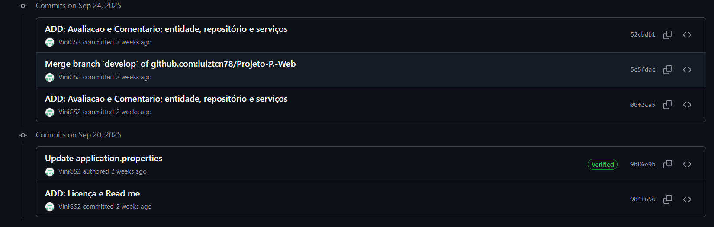
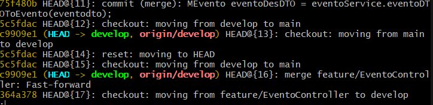
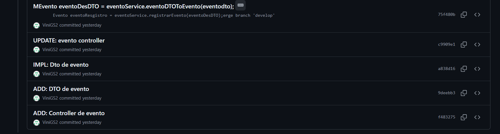
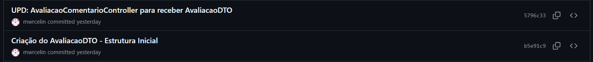
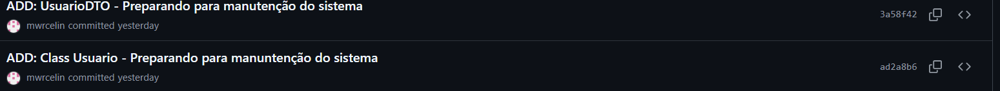
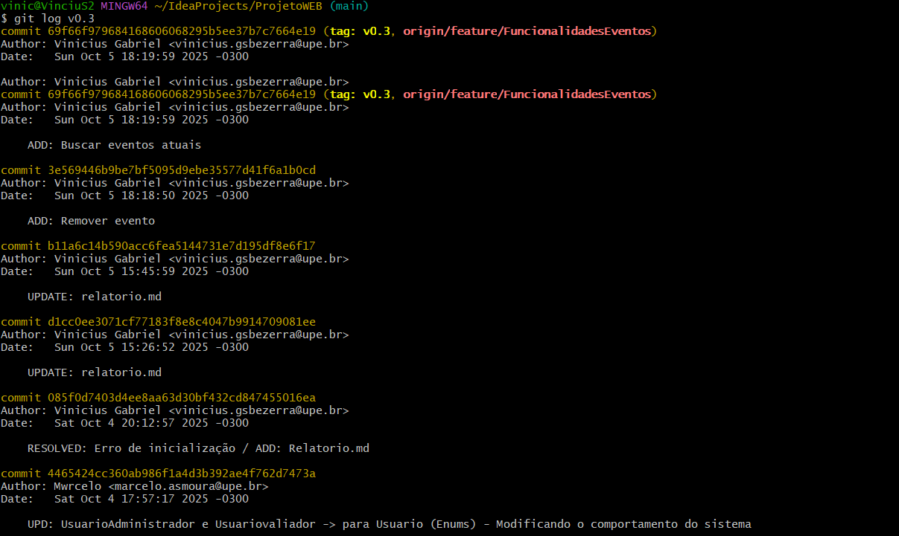
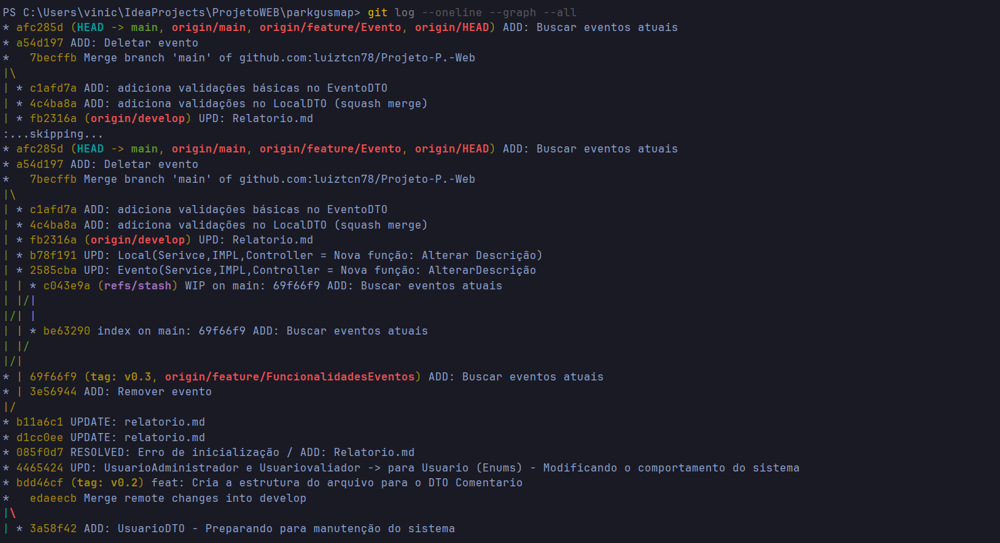
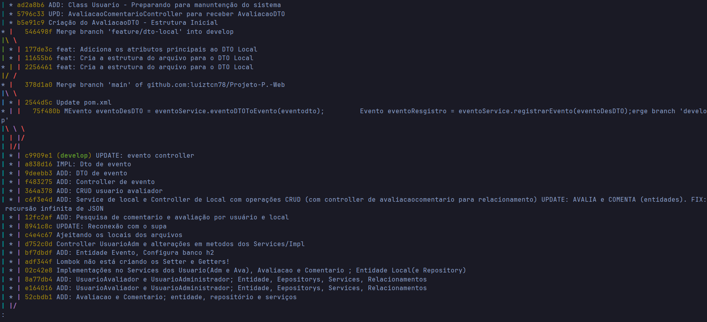
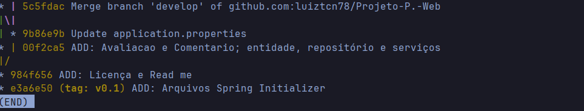

# RELATÓRIO DE PROJETO – Estratégias de Branching em Git
  
## Identificação - **Integrantes da equipe**:
- Vinícius Gabriel Santos Bezerra
- Marcelo Arthur Santos Moura
- Luiz Tenório Carvalho Neto
- **Repositório GitHub**: https://github.com/luiztcn78/Projeto-P.-Web.git

## 1. Estrutura Inicial 
- Branch principal (`main`) criada e configurada? 
``` Sim, a branch Main foi criada e configurada em 20 de setembro e já estava sendo utilizada desde então.```
- Branch `develop` criada a partir de `main`?   
``` Sim, a branch Develop foi criada pouco tempo depois da criação da branch main para melhor organização do código.```
- Descreva como foi feita a configuração inicial (comandos usados e prints).
``` Após a criação do repositório, foram adicionados os arquivos: README.md e LICENSE.txt, utilizando os comandos: "git init", "git remote",  "git add" e "git push", comandos que foram utilizados um tempo depois para a adição dos primeiros códigos do projeto.```

## 2. Fase 1 – Git Flow
### 2.1 Features - Quais features foram criadas?   
- Liste as branches de features e descreva as alterações.:
```Feature/DTOEvento: Feature utilizada para a criação e configuração do DTO da entidade Evento;```
```Feature/EventoControler: Feature utilizada para a criação do Controller da entidade Evento e depois para a implementação do DTO no controller;```
```feature/dto-avaliaco Feature utilizada para a criação do DTO da classe Avaliacao e depois para a implementação do DTO no controller;```
```feature/usuario-class-and-usuario-dto: Feature utilizada para criar a classe unificada Usuario e seus DTO, pensando na mudança de comportamento do Usuario que viria a ser feita;```
- Prints dos commits:




### 2.2 Conflitos - Onde ocorreram conflitos (arquivos/linhas)?   
- Como os conflitos foram resolvidos?   
- Inclua prints mostrando os marcadores (`<<<<<<<`, `=======`, `>>>>>>>`) e o
arquivo final após resolução.
### 2.3 Release - Criada branch `release/2.0`?   
- Alterações preparatórias:
```Finalização e integração das branchs features com develop```
```Merge da main com develop```
```Integração com `main e geração da tag v0.2```

### 2.4 Hotfix - Qual foi o problema corrigido?
```O problema identificado foi a duplicidade de classes de usuário no sistema. Existiam duas entidades distintas (Admin e Avaliador), o que gerava complexidade desnecessária no código e duplicação de lógica.```
```O hotfix consistiu em unificar essas duas classes em uma única classe Usuario, utilizando um enum para diferenciar os papéis de cada tipo de usuário (ex.: ADMIN, AVALIADOR).```
```Essa alteração exigiu uma revisão geral no sistema, com a atualização de serviços, DTOs e controladores que anteriormente dependiam das duas classes separadas, para que passassem a trabalhar com a nova estrutura unificada.```

- Como foi feito o merge do hotfix em `main` e `develop`?   
```Após a conclusão do hotfix, foi feito o merge com a branch main e develop```

- Prints e comandos usados:
```Criação da branch: hotfix/2.0.1/ManutencaoComportamentoUsuariosnoSistema a partir da main feita pelo GitHub```

- Commits: UPD: UsuarioAdministrador e Usuariovaliador -> para Usuario (Enums) - Modificando o comportamento do sistema


- Merge com a main:
```git checkout main ```
```git pull origin main```
```git merge hotfix/2.0.1/ManutencaoComportamentoUsuariosnoSistema```
```git push origin main```

- Merge com a develop:
```git checkout develop```
```git pull origin develop```
```git merge hotfix/2.0.1/ManutencaoComportamentoUsuariosnoSistema```
```git push origin develop```
### 2.5 Uso de Rebase - Em qual feature aplicaram `git rebase`?   
```Não foi usado o git rebase para integração de features com develop```
## 3. Fase 2 – Trunk-Based Development
### 3.1 Branches Curtos - Quais branches foram criados a partir de `main`? 
```Branch: UpdateUsuario / 2 commits```
```Branch: trunkbased/UpdServiceeIMPLEvento / 2 commits```
```Branch: feature/UpdateUsuario / 2 commits```
```Branch: feature/Evento / 2 commits```
### 3.2 Squash - Qual merge foi feito usando **squash**?   
- Explique por que foi escolhido squash em vez de merge normal.:
```Foi utilizado o squash na feature UpdateUsuario. Isto foi feito pois as alterações feitas foram mínimas e a abstração do squash ajudou a deixar o histórico mais limpo e condensado no commit "RESOLVED: Erro de inicialização / ADD: Relatorio.md".```
### 3.3 Tag Final - Tag criada: `v3.0`.
- Prints do histórico.:


## 4. Histórico de Commits
   Inclua saída do comando:
```bash
git log --oneline --graph --all
```




